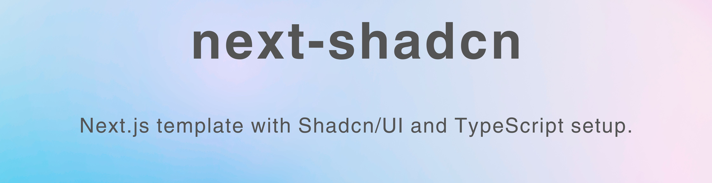

# NextJS-Shadcn-template



[](https://forthebadge.com)

This is a Next JS + Shadcn UI personalized template. Actually, I made this for myself so I don't need to waste my time to overthinking about the config and setup and focusing on the development.

But if you also find this template is useful, you also can use it. And of course I'm open to any feedbacks. You can fork or clone this repo and make a PR here if you have a some idea.

## ⚡ What's include here?

- 🚀 **Next.js 14**
- ⛓️ **TypeScript**
- 👌 **Shadcn/ui**
- 🧥 **Sass and TailwindCSS**
- ✔️ **toolings** for linting, formatting, and conventions configured
  - `eslint`,`prettier`.
- **lucide-react** for icons.

## Pre-requisites

1. [Node.js](https://nodejs.org/en/) or nvm installed.
2. `pnpm` installed.

## How to use it?

1. You can easily use this template by run:

```bash
pnpm create next-app -e https://github.com/pilladipesh33/next-shadcn
```

2. After cloning the project, run this command: `pnpm` or `pnpm install`.

3. Then, run the development server:

```bash
pnpm run dev
```

Open [http://localhost:3000](http://localhost:3000) with your browser to see the result.

You can start editing the page by modifying `app/page.tsx`. The page auto-updates as you edit the file.

## References

- [Next.js Docs](https://nextjs.org/docs/getting-started) - Learn about Next JS and its features
- [Shadcn UI](https://ui.shadcn.com/) - UI component
- [Typescript](https://www.typescriptlang.org/) - The programming language
- [SCSS/SASS](https://sass-lang.com/)
